# Dream Journal

## About

### Description

Dream Journal is a social media application designed to facilitate dream sharing and exploration within a supportive community. The platform combines personal journaling with social features, allowing users to document and share their dreams while maintaining privacy control.

## Project Overview

### Vision

Create an intuitive and engaging platform that helps people explore their dreams and connect with others through shared dream experiences.

### Problems VS Solutions

| Problems                                                 | Solutions                                                                                                            |
| -------------------------------------------------------- | -------------------------------------------------------------------------------------------------------------------- |
| Difficulty remembering dreams and tracking patterns      | Personal dream journal with mood and tag-based organization, which helps identify recurring patterns and themes.     |
| Lack of community for dream sharing and interpretation   | A dedicated social platform for discussing and interpreting dreams, where users can connect and share insights.      |
| Limited tools for dream analysis and understanding       | Tagging system, mood indicators, and searchable dream database allow users to filter, analyze, and interpret dreams. |
| Privacy concerns when sharing personal dream experiences | Flexible privacy settings, including public, private, and anonymous options, allow users to share with confidence.   |

### Target Audience

- People interested in self-exploration, mental wellness, and mindfulness.
- Dream enthusiasts, lucid dreamers, and those interested in dream interpretation.
- Creative individuals (artists, writers, musicians) seeking inspiration from dreams.

### Market Trends

- Growing interest in mental wellness apps and platforms focused on self-care.
- Increased focus on community-driven content and support in social media.
- Rising popularity of dream interpretation and dream journaling.

#### Statistics

| Market Trend                                | Statistic                                                                                | Source                                                                                                                                                  |
| ------------------------------------------- | ---------------------------------------------------------------------------------------- | ------------------------------------------------------------------------------------------------------------------------------------------------------- |
| **Mental Wellness App Market Growth**       | Valued at $7.48B in 2024, projected to reach $17.52B by 2030 at a CAGR of 14.6%          | [Grand View Research](https://www.grandviewresearch.com/horizon/outlook/mental-health-apps-market-size/global)                                          |
| **Mental Wellness App Market Growth**       | Projected to reach $25.1B by 2032 with a CAGR of 16.7% from 2024                         | [Acumen Research](https://www.acumenresearchandconsulting.com/mental-health-app-market)                                                                 |
| **Digital Journaling App Market Expansion** | Valued at $5.3B in 2023, expected to reach $15.2B by 2033 with 11.1% CAGR                | [Future Market Insights](https://www.futuremarketinsights.com/reports/digital-journal-apps-market)                                                      |
| **Digital Journaling App Market (US)**      | US market to reach $1.8B by 2033 with 22.6% CAGR                                         | [Future Market Insights](https://www.futuremarketinsights.com/reports/digital-journal-apps-market)                                                      |
| **Community-Driven Wellness Content**       | 180M+ health-related searches on Xiaohongshu in 2023                                     | [Vogue Business](https://www.voguebusiness.com/story/consumers/lazy-sleeping-beauty-and-adult-milk-tea-the-wellness-trends-driving-engagement-in-china) |
| **Rise of Prosocial Media Platforms**       | Platforms like Community Notes and YouTube push for more empathetic social networks      | [Wired](https://www.wired.com/story/prosocial-media-social-networks-discourse-decentralization)                                                         |
| **Global Interest in Dream Interpretation** | 74% of Indians, 65% of South Koreans, and 56% of Americans value dreams for self-insight | [Wikipedia - Dream Interpretation](https://en.wikipedia.org/wiki/Dream_interpretation)                                                                  |

### Roadmap & Future Vision

#### Q1-Q2 (Beta Launch)
- Launch basic dream journaling functionality and allow users to share dreams publicly or privately.
- Enable **tagging**, **mood indicators**, and **privacy controls** (public/private/anonymous).

#### Q3-Q4 (Advanced Features)
- Implement **advanced search** (by mood, tags, keywords) and introduce **commenting** and **liking** for community engagement.
- Enhance **pattern tracking** and **analytics** for user insights on recurring dream themes.

#### Year 2 (Expansion)
- Roll out **mobile apps** for iOS and Android.
- Introduce **premium subscriptions** for advanced analytics and personalized dream reports.

#### Long-term Vision
- Explore **AI-powered dream interpretation** and integrate with other wellness platforms.
- Expand into **global markets**, offering multilingual support and local dream communities.

## Core Features

### Writing and capture
- **Dreams** with title, mood, tags and privacy (public, private or anonymous). Drafts are saved automatically while you write.
- **Quick capture** ("I just woke up"): one big box or **voice dictation**, saved as a private draft before the dream fades.

### Reading and discovering
- **Home** with a welcome hero, your streak and a summary of your last 30 days.
- **Explore** with infinite scroll, keyword search and mood/theme filters kept in the URL.
- A reading-friendly dream page with threaded comments and replies, likes, sharing and `@mentions`.

### Insights
A private **Insights** page: calendar heatmap, streaks, mood and theme breakdowns, weekday rhythm and plain-language highlights about your own dreams.

### Notifications
Comments, replies, mentions, grouped likes and moderation notices in a bell and an inbox. Moderators and admins also get **appeal** notifications and inbox filters (All, Appeals, Activity, Decisions on my content, Unread only).

### Safety and moderation
- Report a dream or a comment, and block users (mutual and silent). Blocked users can manage the list from profile settings.
- **Moderation panel** for staff: report queue, cases, suspensions, audit log, and staff management for admins. Content that gets enough reports is hidden automatically (threshold configurable).
- Authors are told what happened and **can appeal**. A moderator cannot decide an appeal against their own decision, and appeals against a suspension are for admins. Staff see the concerned content in context, with a link to the full case.
- Roles: `user`, `moderator`, `admin`.

### Design
Light and dark themes, a token-based design system, accessible components and a responsive layout with a bottom bar on phones. See [docs/design-system.md](docs/design-system.md).

## Screenshots

### Writing

| Home | Welcome page (signed out) |
| --- | --- |
| 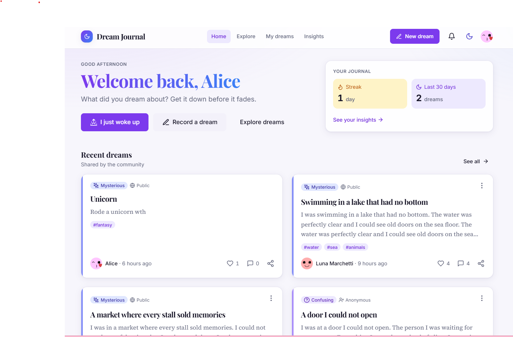 | 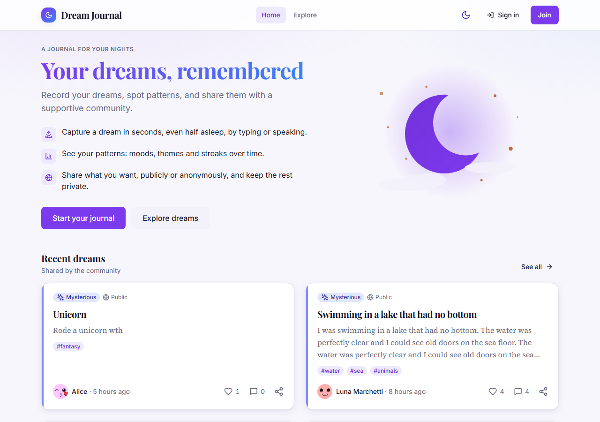 |

| Recording a dream | Quick capture ("I just woke up") |
| --- | --- |
| 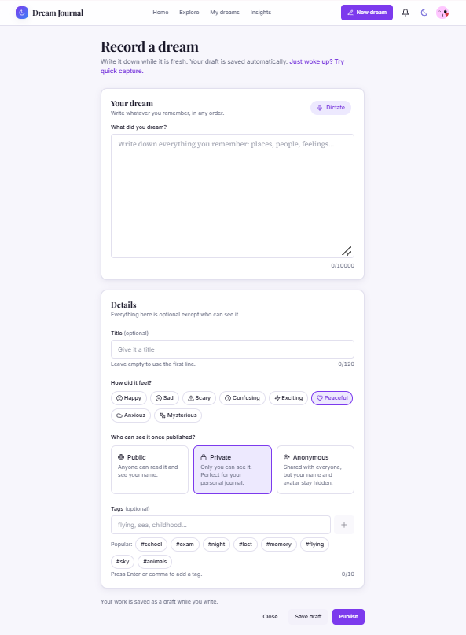 | 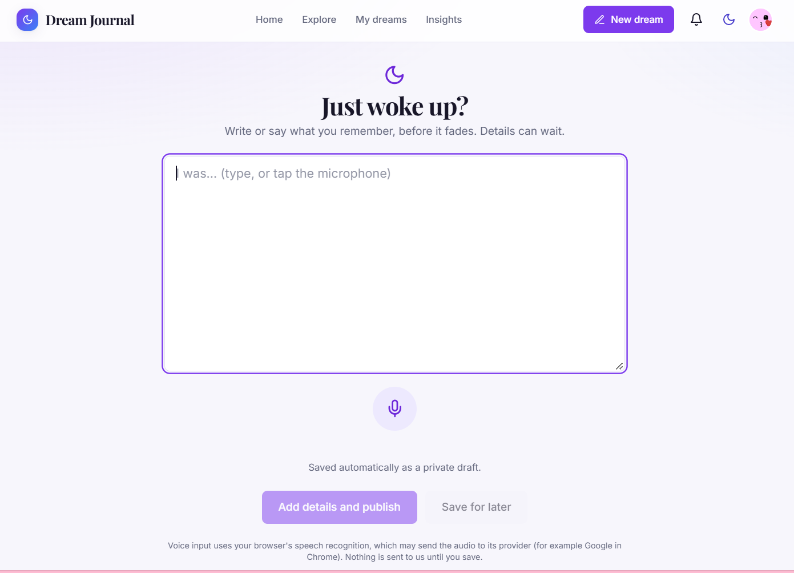 |

### Reading and sharing

| Explore | Reading a dream |
| --- | --- |
| 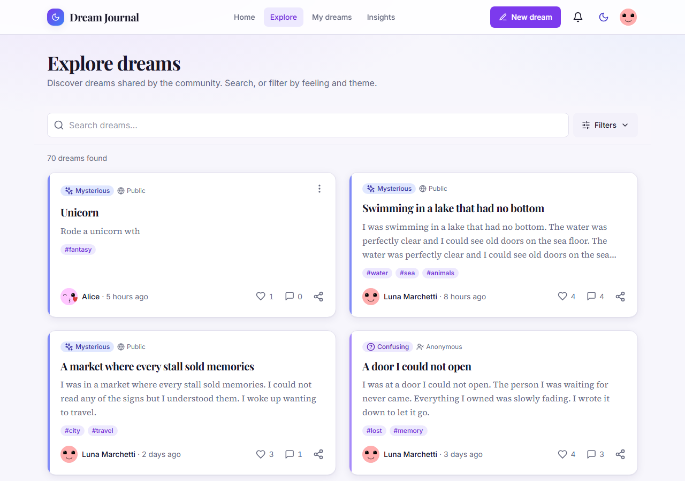 | 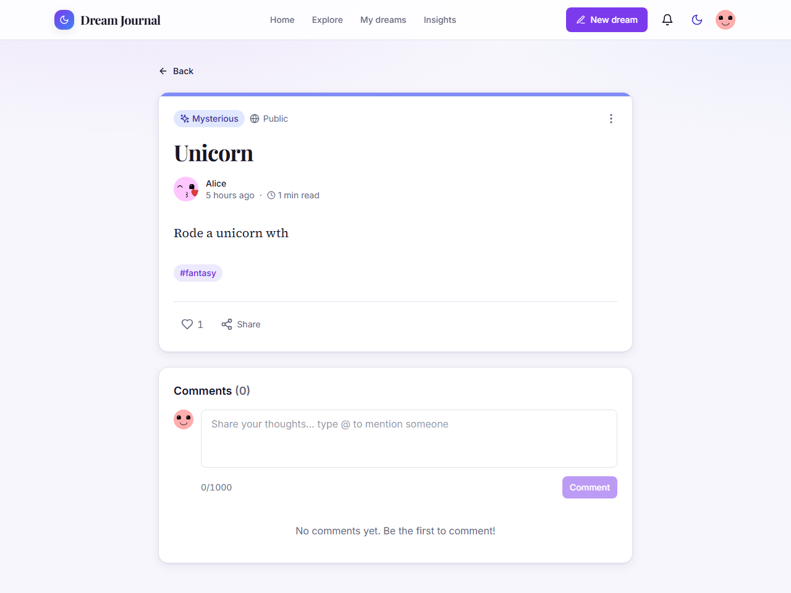 |

### Insights and profile

| Insights | Patterns and themes |
| --- | --- |
| 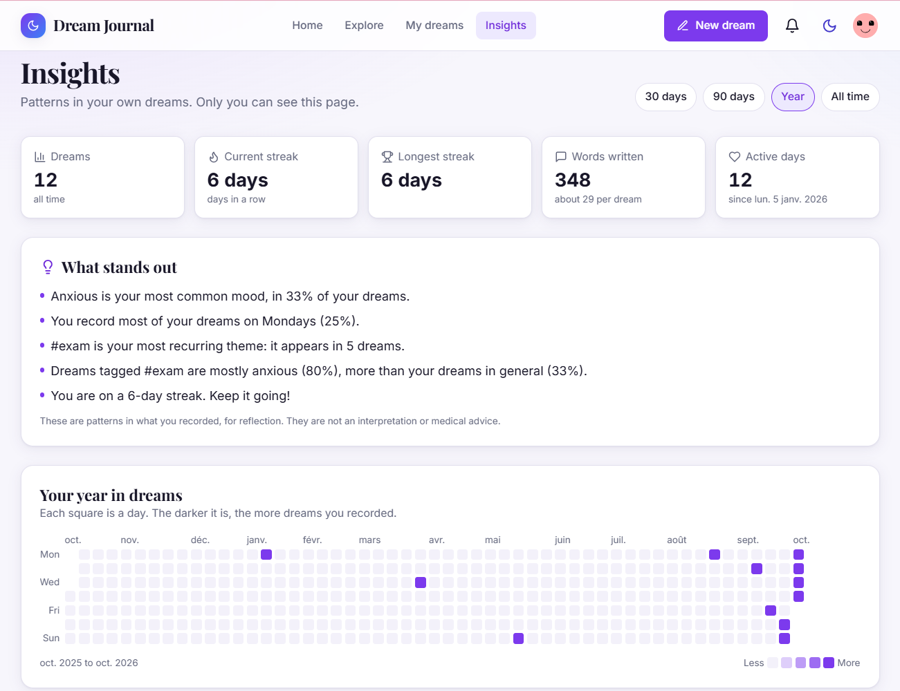 | 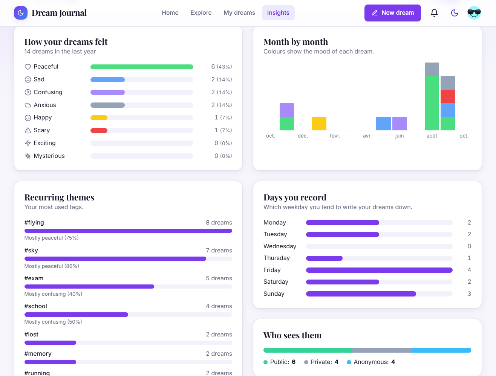 |

| Custom avatar | Dark theme |
| --- | --- |
| 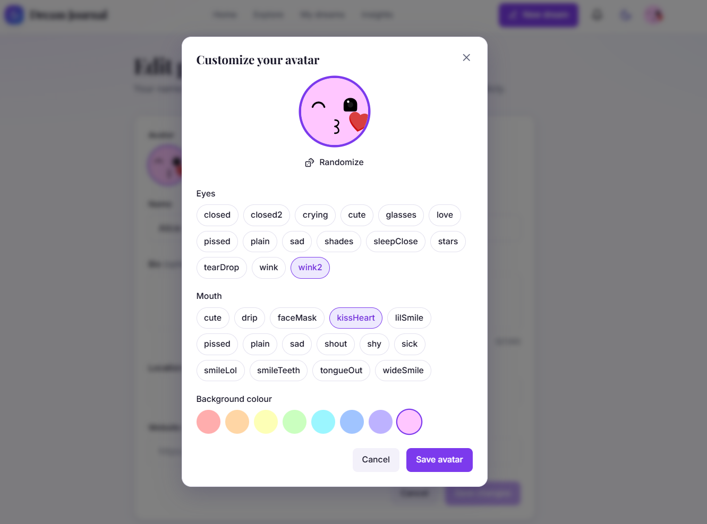 | 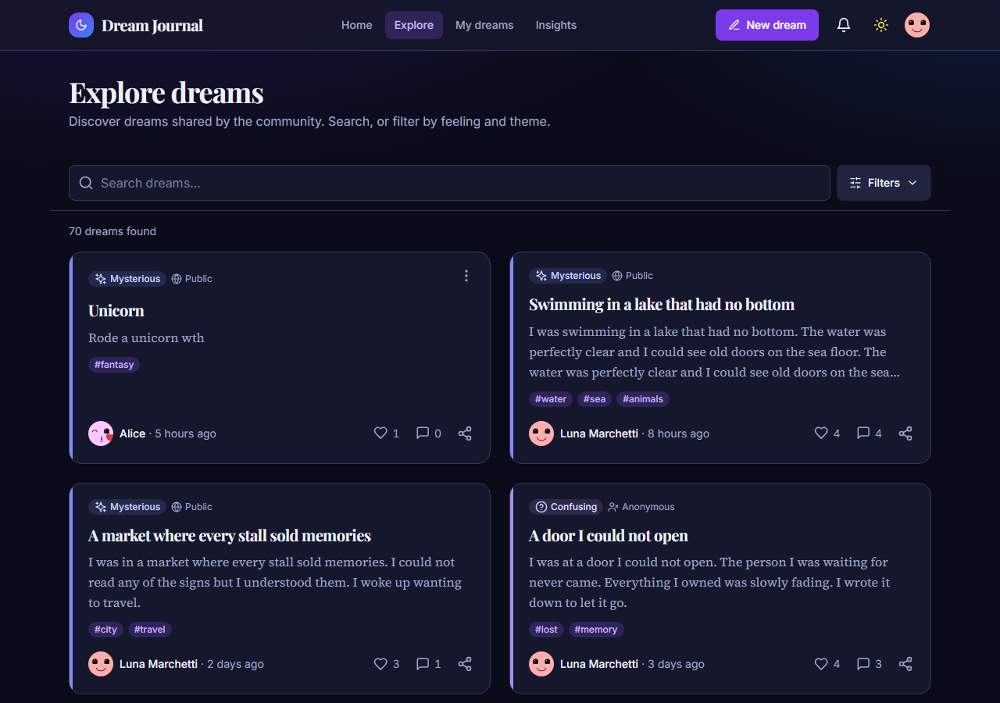 |

### Moderation

| Moderation panel | Appealing a decision |
| --- | --- |
| 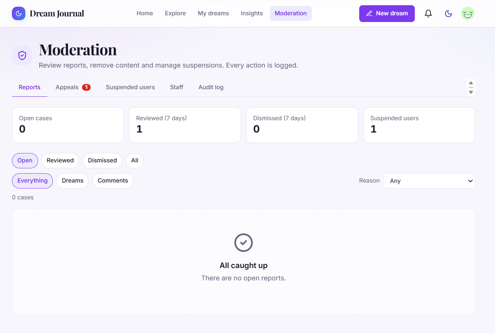 | 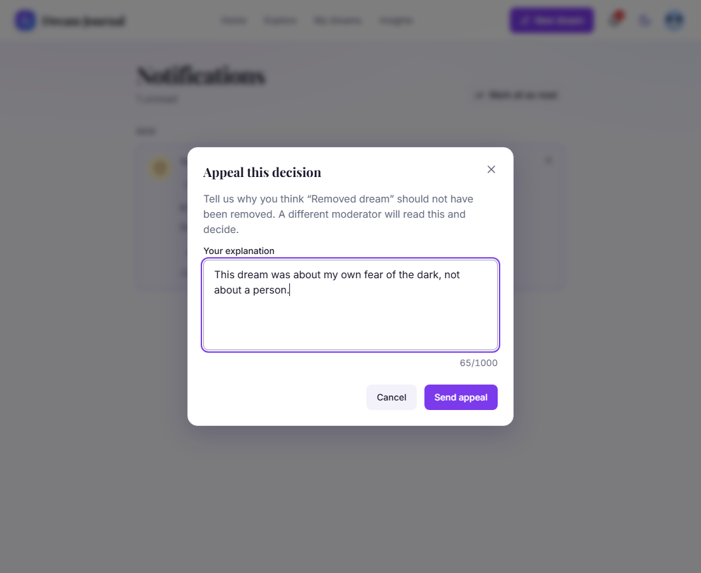 |

| Staff inbox with appeals |
| --- |
| 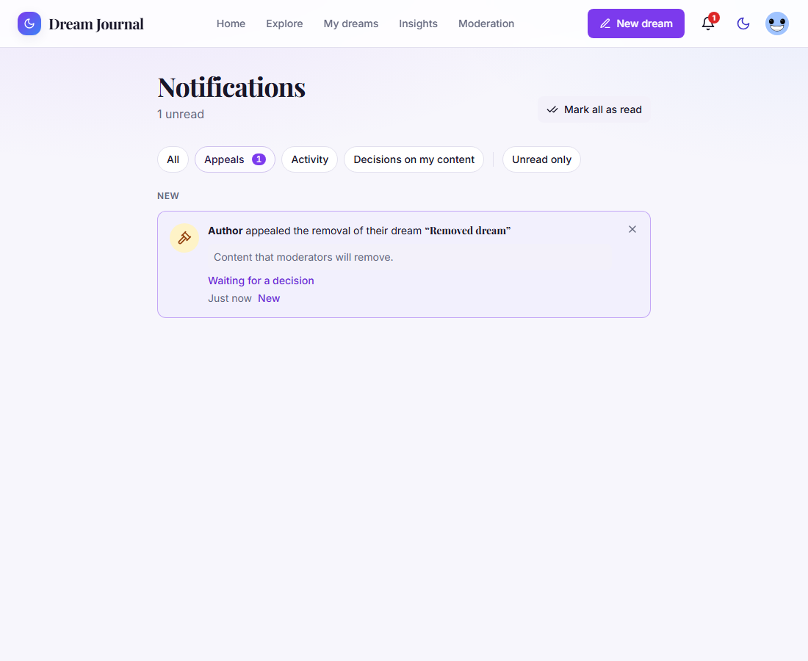 |

### On a phone

| Home | Reading |
| --- | --- |
| 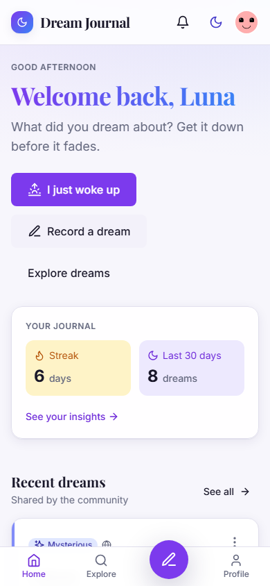 | 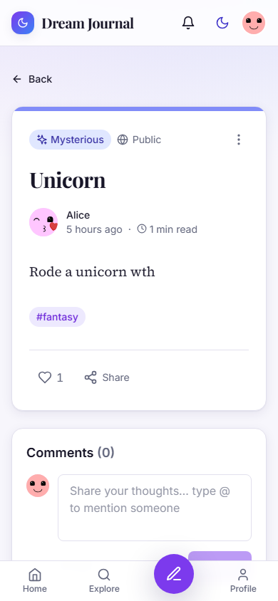 |

## Tech stack

- **Frontend:** React 18, Vite, TypeScript, Tailwind CSS, React Router.
- **Backend:** Node.js, Express 4, Mongoose 8, MongoDB, zod validation.
- **Security:** httpOnly-cookie JWT sessions, CSRF origin check, rate limiting, strict CSP and security headers.

## Quick start

Requires Node.js 20+ and a MongoDB instance.

```bash
npm install
cp .env.example .env        # set MONGODB_URI and a JWT_SECRET of 32+ characters
npm run dev:all             # frontend on :5173, API on :5000
```

Useful scripts:

| Script | What it does |
| --- | --- |
| `npm test` | Unit tests |
| `npm run test:e2e` | End-to-end API tests against a real MongoDB (throwaway databases) |
| `npm run typecheck` / `npm run lint` | Type check and lint |
| `npm run build` | Production build of the frontend |
| `npm run seed-demo` | Demo users with dreams and comments |
| `npm run make-admin` / `npm run seed-staff` | Create or promote administrators and moderators |
| `npm run migrate` | Apply data migrations |

## Documentation

Setup, architecture, API reference, security notes and the design system live in [docs/](docs/README.md).
